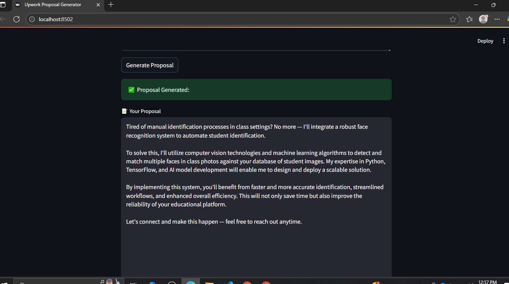

# ✍️ Upwork Proposal Generator

Writing Upwork proposals can be stressful, repetitive, and time-consuming.  
This project is a smart assistant that helps you create **ready-to-send proposals** that sound professional, natural, and tailored to the client.  

It uses a proven structure (AIDA: Attention, Interest, Desire, Action) so every proposal is short, clear, and focused on solving the client’s problem — not filled with fluff.

---

## 🌟 What It Does
- 📋 You paste the **job description** and your **profile summary**  
- 🤖 The tool instantly creates a **client-focused proposal**  

## 🎯 Why It’s Useful
- Saves time ⏳ → no more writing proposals from scratch  
- Sounds human 👤 → avoids robotic, copy-paste text  
- Always relevant ✅ → focuses only on the client’s needs  
- Ready to send 💌 → just copy-paste into Upwork  

## 🛠️ Tech Stack
- **Python 3.10**
- **LangChain** → prompt templates & workflow  
- **Google Gemini AI (or any LLM)** → text generation  
- **dotenv** → environment variables  
- **Streamlit** → simple UI 